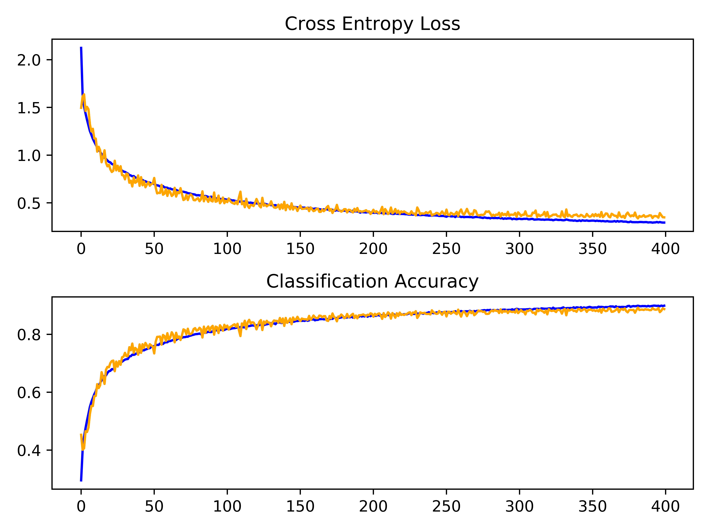

# CIFAR-10 Dataset

CIFAR is an acronym that stands for the Canadian Institute for Advanced Research and the CIFAR-10 dataset was developed along with the CIFAR-100 dataset by researchers at the CIFAR institute. The dataset is comprised of 60,000 32×32-pixel color photographs of objects from 10 classes, such as frogs, birds, cats, ships, etc. There are 50,000 examples in the training dataset and 10,000 in the test dataset. The class labels and their standard associated integer values are listed below:

0. airplane
1. automobile
2. bird
3. cat
4. deer
5. dog
6. frog
7. horse
8. ship
9. truck

These are very small images, much smaller than a typical photograph, as the dataset was intended for computer vision research. CIFAR-10 is a well-understood dataset and is widely used for benchmarking computer vision algorithms in the field of machine learning. The problem is solved. It is relatively straightforward to achieve 80% classification accuracy. Top performance on the problem is achieved by deep learning convolutional neural networks with a classification accuracy above 90% on the test dataset.

Listed below is the figure of the first nine images in the dataset. It can be challenging to see what exactly is represented in some of the images given the extremely low resolution. This low resolution is likely the cause of the limited performance that top-of-the-line algorithms are able to achieve on the dataset.

  

## Requirements
~~~bash
pip install matplotlib 
pip install tensorflow 
pip install Keras 
~~~

## Results
The diagnostics involve creating a line plot showing model performance on the train and test set during training. These plots are valuable for getting an idea of whether a model is overfitting, underfitting, or has a good fit for the dataset. We will create a single figure with two subplots, one for loss and one for accuracy. The blue lines will indicate model performance on the training dataset and orange lines will indicate performance on the hold-out test dataset. The plot is saved to a file, specifically a file with the same name as the script with a png extension. Running the code prints the classification accuracy. The model achieved accuracy 88.80%. The results in figure below show that the model is now learning well, and we have good control over the rate of learning without overfitting.

  

