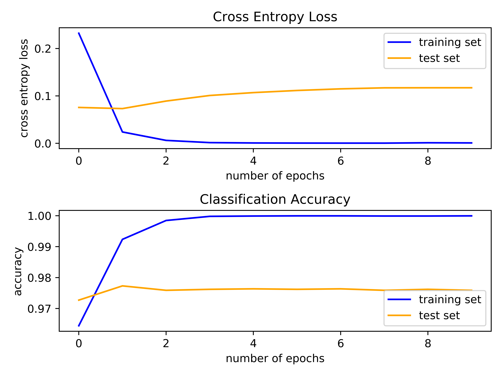

# Dogs & Cats Dataset

The Dogs vs. Cats dataset is a standard computer vision dataset that involves classifying photos as either containing a dog or cat. The dataset can be downloaded for free from the [Kaggle website](https://www.kaggle.com/c/dogs-vs-cats/data). The dataset is comprised of 25,000 labeled photos, 12,500 dogs, and the same number of cats. As we can see in the figures below, the photos in the dataset are color and have different shapes and sizes. The photos were reshaped prior to modeling so that all images have the same shape. Fixed-size of 200×200 pixels was chosen.

<table align="center">
  <tr>
    <td></td>
    <td></td>
  </tr>
</table>

This model is also based on VGG blocks and uses the regularization methods, dropout, and data augmentation. In Addition, this problem is a binary classification task, requiring the prediction of one value of either 0 or 1. Therefore the output layer, with 1 node, in the model uses the sigmoid activation function, instead of the softmax function (which is used for a multiclass classification task). The model will be optimized using the binary cross-entropy loss function.

## Requirements
~~~bash
pip install matplotlib 
pip install tensorflow 
pip install Keras 
~~~

## Realization of the model Dogs vs. Cats by using Transfer Learning 
Transfer learning involves using all or parts of a model trained on a related task. We used the VGG16 model with 16 layers. The model is comprised of two main parts, the feature extractor part of the model that is made up of VGG blocks, and the classifier part of the model that is made up of fully connected layers and the output layer. We used the feature extraction part of the model and added a new classifier part of the model that is tailored to the dogs and cats dataset. The weights of all of the convolutional layers were fixed during training, and only the new fully connected layers, that will learn to interpret the features extracted from the model and make a binary classification, were trained.

We loaded the VGG16 model, removed the fully connected layers from the output-end of the model, then added the new fully connected layers to interpret the model output and make a prediction. Next, we trained the model as before on the training dataset. Less training will be required in this case, as only the new fully connected and output layer have trainable weights. Therefore, we set the number of training epochs to 10 with a default batch size of 64 examples. Because of the way it was originally trained, the VGG16 model is configured to expect the input images to have the shape 224x224 pixels. The model also expects images to be centered so that they have the mean pixel values from each channel (red, green, and blue). The required values ([123.68, 116.779, 103.939]) were taken from the literature to achieve this goal. 

Once the model has been evaluated, the results are presented. There are two key aspects to examine: the diagnostics of the learning behavior of the model during training and the estimation of the model performance. First, the diagnostics involve creating a line plot showing model performance on the train and test set during training. These plots are valuable for getting an idea of whether a model is overfitting, underfitting, or has a good fit for the dataset. We will create a single figure with two subplots, one for loss and one for accuracy. The blue lines will indicate model performance on the training dataset and orange lines will indicate performance on the hold-out test dataset. The plot is saved to a file, specifically a file with the same name as the script with a png extension. Running the code prints the classification accuracy. The model achieved an accuracy of 97.906%.

  

The results in the figure below suggest that the model has good results in the training as well as in testing. By reviewing the learning curves in both cases, we can see that the results indicate that the model performs well. 

## Using Transfer Learning with the ResNet50 model on the problem
We will explore how using Transfer Learning with a different model, ResNet50 will impact the model's performance. We chose model ResNet50 because, like VGG16, this model receives input of the size 224x224 pixels, and expects images to be centered. In this case, we decided to perform Transfer Learning in the same way it was done before, by removing the fully connected layers from the output-end of the model, then adding the new fully connected layers to interpret the model output and make a prediction. It is, therefore, necessary to perform weight training only to the new fully connected layers and output layer.

This comparison interested us because the differences between the performance of the two models will allow us to deduce which of them is more appropriate for solving the problem. The main impact on each model's performance will be determined by the feature extraction part which was pre-trained. 

Running the code, prints the classification accuracy. The model achieved an accuracy of 98.413%. The results in the figure below suggest that the model has good results in the training as well as in testing. The ResNet50 model achieved slightly better accuracy results than the VGG16 model, 98.413% in comparison to the 97.906%.

  

