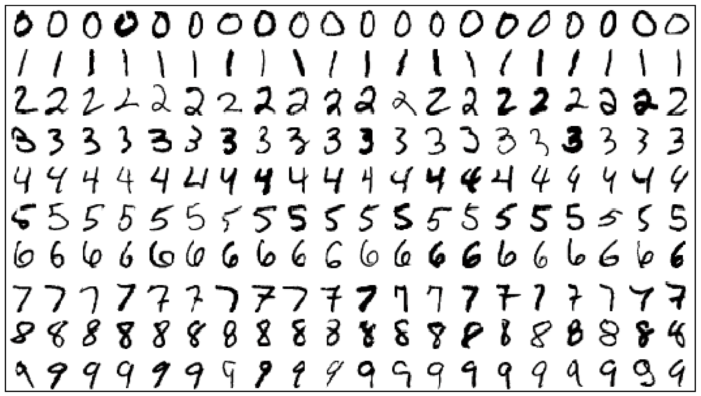

# MNIST Dataset
The MNIST dataset was curated by LeCun, Corinna Cortes, and Chris Burges. It consists of 60,000 handwritten digits for training an algorithm, and 10,000 more for validating the algorithm’s performance on previously unseen data. It is a subset of a larger set available from NIST. The digits have been size-normalized and centered in a fixed-size image. 
The MNIST dataset is ubiquitous across deep learning tutorials, and for good reason. By modern standards, the dataset is small enough that it can be modeled rapidly, even on a laptop computer processor. In addition to their portable size, the MNIST digits are handy because the handwriting samples are sufficiently diverse and contain complex enough details that they are not easy for a machine-learning algorithm to identify with high accuracy, and yet by no means do they pose an insurmountable problem.

An example of a simple three-layer artificial neural network whose purpose is to predict what digit a given handwritten MNIST image represents. The first layer of the network is reserved for inputting the MNIST digits. The second layer is the hidden layer of 64 sigmoid artificial neurons, which are responsible for learning representations of the input data so that the network can predict what digit a given image represents. The third layer is the output layer, it consists of 10 softmax neurons, each one meant to represent a category of a digit. 

At the beginning of training, the network's performance is not impressive, but as it continues to train a significant improvement can be seen. After 10 epochs of training, it correctly classifies 36.5 percent of the validation images. After 200 epochs, the network’s improvement appears to be plateauing as it approaches 86 percent validation accuracy.

### Requirements
~~~bash
pip install matplotlib 
pip install tensorflow 
pip install Keras 
~~~

  

