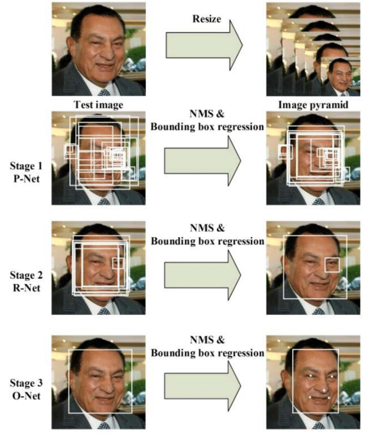

# MTCNN
MTCNN (Multi-task Cascaded Convolutional Networks) is a framework developed as a solution for both face detection and face alignment. The process consists of three stages of convolutional networks that are able to recognize faces and landmark location such as eyes, nose, and mouth. The Three Stages of MTCNN: first, the image is rescaled to a range of different sizes (called an image pyramid), then the first model (Proposal Network or P-Net) proposes candidate facial regions, the second model (Refine Network or R-Net) filters the bounding boxes, and the third model (Output Network or O-Net) proposes facial landmarks. The figure below provides a summary of the three stages from top-to-bottom and the output of each stage left to right. 

<p align="center">
  
</p>

The model is called a multi-task network because each of the three models in the cascade (P-Net, R-Net, and O-Net) are trained on three tasks. e.g. make three types of predictions: face classification, bounding box regression, and facial landmark localization. The three models are not connected directly, instead, outputs of the previous stage are fed as input to the next stage. This allows additional processing to be performed between stages.

```python
import json
from mtcnn.mtcnn import MTCNN
from matplotlib import pyplot

image = pyplot.imread('.\data\bari.jpg')
# create the detector, using default weights
detector = MTCNN()
# detect faces in the image
faces = detector.detect_faces(image)
# print faces
print(json.dumps(faces, indent=3))

[
   {
      "box": [
         249,
         140,
         267,
         337
      ],
      "confidence": 0.9990038275718689,
      "keypoints": {
         "left_eye": [
            331,
            246
         ],
         "right_eye": [
            454,
            275
         ],
         "nose": [
            373,
            351
         ],
         "mouth_left": [
            311,
            382
         ],
         "mouth_right": [
            421,
            405
         ]
      }
   }
]
```
The detector returns a list of JSON objects. Each JSON object contains three main keys: 'box', 'confidence' and 'keypoints':
- The bounding box is formatted as [x, y, width, height] under the key 'box'.
- The confidence is the probability for a bounding box to be matching a face.
- The keypoints are formatted into a JSON object with the keys 'left_eye', 'right_eye', 'nose', 'mouth_left', 'mouth_right'. Each keypoint is identified by a pixel position (x, y).

## Requirements
~~~bash
pip install matplotlib
pip install opencv-python
pip install tensorflow
pip install Keras
pip install mtcnn
~~~

## Results
<p align="center">
  
  
  
</p>
