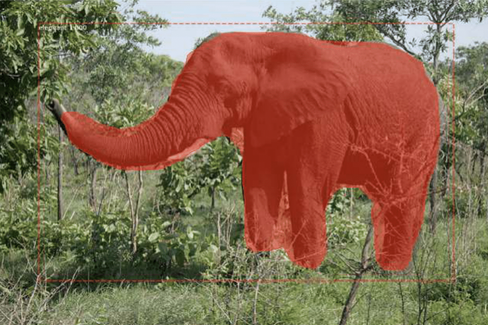

# Mask R-CNN model

The Region-Based Convolutional Neural Network, or R-CNN, is a family of convolutional neural network models designed for object detection, similar to the YOLO model from the previous chapter. The R-CNN approach to bounding-box object detection is to attend to a manageable number of candidate object regions and evaluate convolutional networks independently on each Region of Interest (ROI). The figure shows the summary of the R-CNN Model Architecture.

  

There are perhaps four main variations of the approach, the most recent is called Mask R-CNN, which supports both object detection and object segmentation. Each variation of the R-CNN has its own prominent aspects:
* **R-CNN:** bounding boxes are proposed by the selective search algorithm, each of which is stretched, and features are extracted via a deep convolutional neural network, such as AlexNet before a final set of object classifications are made with linear SVMs.
* **Fast R-CNN:** simplified design with a single model, bounding boxes are still specified as input, but a region-of-interest pooling layer is used after the deep CNN to consolidate regions and the model predicts both class labels and regions of interest directly.
* **Faster R-CNN:** addition of a Region Proposal Network that interprets features extracted from the deep CNN and learns to propose regions-of-interest directly.
* **Mask R-CNN:** extension of Faster R-CNN that adds an output model for predicting a mask for each detected object. 

The family of methods may be among the most effective for object detection, achieving then state-of-the-art results on computer vision benchmark datasets. Although accurate, the different variations of the R-CNN model can be slow when making a prediction as compared to alternate models such as YOLO that may be less accurate but are faster, since they are designed for real-time prediction.

## Requirements
~~~bash
pip install tensorflow 
pip install mask-rcnn
pip install Keras 
~~~

## Results

Running the code shows the image of the elephant with the annotations predicted by the Mask R-CNN model, specifically:
* **Bounding Box:** dotted bounding box around each detected object.
* **Class Label:** class label assigned to each detected object written in the top left corner of the bounding box.
* **Prediction Confidence:** the confidence of class label prediction for each detected object written in the top left corner of the bounding box.
* **Object Mask Outline:** polygon outline for the mask of each detected object.
* **Object Mask:** polygon fill for the mask of each detected object.

  

