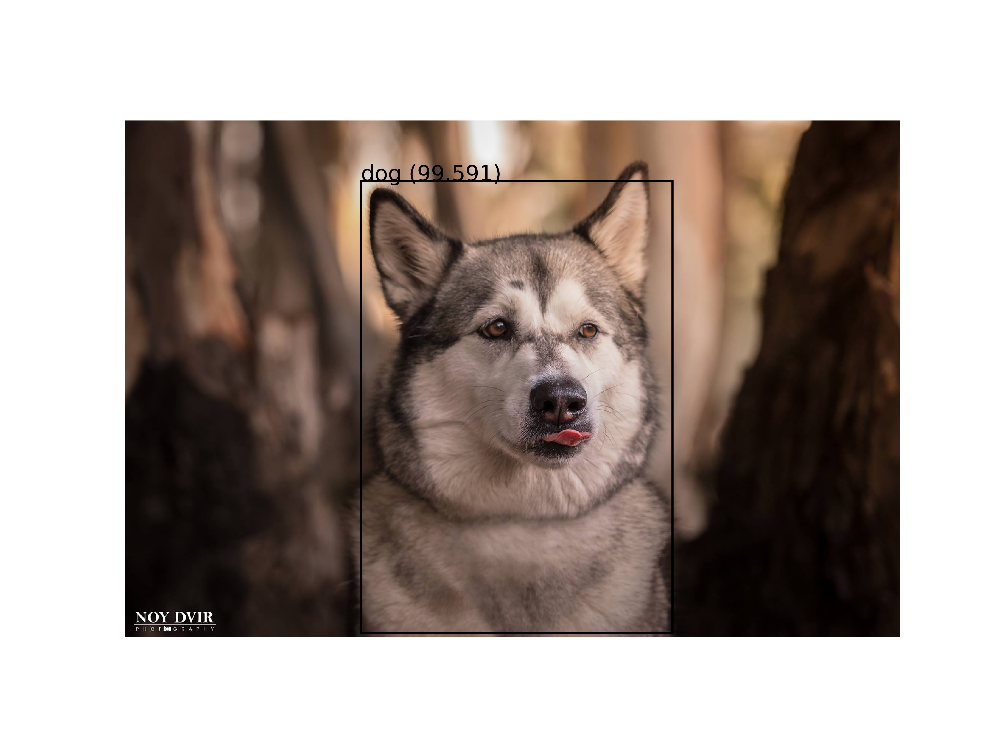

# Undergraduate Final Project - Deep Learning for Computer Vision

The project deals with Deep Learning for Computer Vision.
* **Computer Vision** is a field that deals with the automatic processing of images, in order to extract and interpret visual information hidden in the images. 
* **Deep learning** is a network made up of several layers of neurons, with the number of neurons in each layer varying depending on the location of the layer and the unique need of the network.

<table align="center">
  <tr>
    <td></td>
    <td></td>
  </tr>
</table>

Each layer of neurons calculates, according to the activation function defined for it, the weight values that constitute the outputs transmitted as input to the next layer. After construction, the model training process includes learning and optimization in order to achieve optimal performance and results. In this process, several epochs are performed, at the end of each of which a backpropagation is performed, which makes it possible to adjust the weight of the neurons in each layer according to their importance and effect on the process. At the end of the process, the optimal weights are selected, and it is possible to move on to the stage of testing the performance of the trained model. These tests are performed against new information, which was not included in the information on which the model was trained, and at this stage, no learning is performed (as a result, no backpropagation or weight value adjustment is performed). The model output obtained at the end of this stage is the prediction of the classification performed by it and the success rates in matching the classification. 

The project is a research project, which combines in-depth learning of the field, experimentation, and application of a variety of different models for classification or locating objects in an image. The model architecture is implemented by CNN (Convolutional Neural Network), which includes one or more convolution layers. This layer specializes in image recognition and computer vision tasks, allowing the model to efficiently process spatial patterns in an image. In the first part of the project, we implemented CNN networks for classifying images for known datasets ([MNIST](1%20-%20MNIST%20Dataset%20-%20Handwritten%20Digits/), [Fashion-MNIST](2%20-%20Fashion-MNIST%20Dataset/), [CIFAR-10](3%20-%20CIFAR-10%20Dataset/), [Dogs and Cats](4%20-%20Dogs%20%26%20Cats%20Dataset%20-%20Transfer%20Learning/)), and each model was expanded for research and experiments to achieve improvement in model performance. In the second part we applied models ([YOLO](5%20-%20YOLO%20model%20-%20ImageAI/), [Mask R-CNN](7%20-%20Mask%20R-CNN%20model/), [MTCNN](8%20-%20MTCNN%20model/), [VGGFace2](9%20-%20VGGFace2%20model/)) for object detection and recognition in the image and in real-time. An extension was made for each model in order to test its performance with new information. In addition, for the [YOLO model, Transfer Learning was performed in order for the model to locate and identify another object, the kangaroo](6%20-%20Training%20YOLO%20model%20using%20Darknet/). Transfer Learning is a common method that allows you to preserve the knowledge accumulated in solving one problem and its application to solve another related problem. In this method, we will use a part of an existing model that has been trained for a similar task and make an adjustment to the classifier part for our problem.

Finally, we developed a [GAN for the MNIST dataset](10%20-%20GAN%20model%20-%20MNIST%20Handwritten%20Digits/). Generative Adversarial Network is an architecture for training generative models, such as deep convolutional neural networks for generating images. A GAN involves two deep learning networks pitted against each other in an adversarial relationship. One network is a generator that produces forgeries of images, and the other is a discriminator that attempts to distinguish the generator’s fakes from the real thing. The generator is tasked with receiving a random noise input and turning this into a fake image. The discriminator, a binary classifier of real versus fake images. Over several rounds of training, the generator becomes better at producing more convincing forgeries, and so too the discriminator improves its capacity for detecting the fakes. As training continues, the two models battle it out, trying to outdo one another, and, in so doing, both models become more and more specialized at their respective tasks. Eventually, this adversarial interplay can culminate in the generator producing fakes that are convincing not only to the discriminator model but also to the human eye. At some point, the two adversarial models arrive at a stalemate: They reach the limits of their architectures and learning stalls on both sides.

The conclusion of the study is that given preliminary information based on the literature and pre-trained models, the results of the models can be improved using a number of methods. for example:
* **Pre-processing of the information (images) and performing Data Augmentation**, a method that allows you to add copies of images to the training set. Changes were made to these copies, such as rotation, inversion, smoothing, etc.
* **Adding layers that aim to minimize/reduce the number of calculations** in the following layers, such as Dropout, Batch Normalization, Pooling, etc.

  

